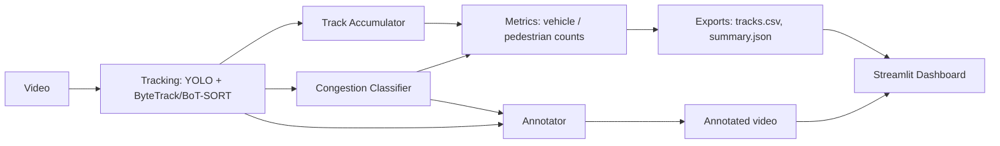

# AI Traffic Intelligence

A computer vision pipeline that watches a video of an urban avenue and reports exactly three
things: how many vehicles it saw, how many pedestrians it saw, and how congested the traffic
was — low, moderate, or high.

## Motivation

Most "YOLO on traffic video" demos either stop at raw per-frame detection (no persistent
identity, so the same car gets counted once per frame it's visible in) or bolt on a long list
of derived metrics whose accuracy nobody has actually checked against the footage. This project
picked the opposite trade-off: a small, sharp set of outputs — vehicle count, pedestrian count,
congestion level — built on tracking (not raw detection) so counts reflect distinct objects, and
tuned against real footage rather than left at library defaults.

## Features

- Vehicle detection and counting (car, bus, truck, motorcycle, bicycle — configurable)
- Pedestrian detection and counting, reported separately from vehicles
- Multi-object tracking (ByteTrack or BoT-SORT) so each vehicle/person is counted once, not
  once per frame
- Minimum-duration filtering to reject brief detector flicker before it inflates a count
- Congestion classification (LOW / MODERATE / HIGH) from vehicle density, smoothed over time
  so a single busy frame doesn't flip the reported level
- Annotated output video: boxes, track IDs, and a live Vehicles / People / Traffic panel
- Streamlit dashboard over the exported results
- CPU-only by default, automatic CUDA use when available

## Architecture



| Package | Responsibility |
|---|---|
| `config` | Pydantic-validated configuration, loaded from YAML |
| `schemas` | Data models (`TrackedDetection`, `TrackSummary`, `TrafficMetrics`) |
| `tracking` | YOLO detection + ByteTrack/BoT-SORT tracking in one call, plus track bookkeeping |
| `analytics` | Congestion classification and metrics computation |
| `visualization` | Annotated-frame rendering |
| `persistence` | CSV/JSON writers |
| `pipeline` | Video ingestion and the run orchestrator |
| `cli.py` | Command-line entry point |
| `dashboard/` (top-level) | Streamlit app reading the pipeline's exported outputs |

`dashboard/` sits outside `src/` deliberately: it only reads the files the pipeline exports
(CSV/JSON/MP4), so it has zero dependency on the `traffic_intelligence` package internals.

## Pipeline

1. **Ingestion** (`pipeline.video_source.VideoSource`) opens the video and validates FPS,
   resolution, and readability up front.
2. **Detection + tracking** (`tracking.UltralyticsTracker`) runs YOLO with ByteTrack/BoT-SORT
   per frame in a single call, producing detections with persistent `track_id`s, restricted to
   the configured vehicle classes plus the person class.
3. **Accumulation** (`tracking.TrackAccumulator`) tallies frames-seen and a class vote per
   track ID, and drops any track shorter than `tracking.min_track_seconds`.
4. **Congestion classification** (`analytics.CongestionClassifier`) compares the number of
   vehicles visible in each frame against configured thresholds, smoothed over a rolling window.
5. **Visualization** (`visualization.FrameAnnotator`) draws boxes, IDs, and the live summary
   panel onto each frame if `output.save_annotated_video` is enabled.
6. **Export** (`persistence`) writes `tracks.csv`, `metrics.json`, and `summary.json`.
7. **Dashboard** (`dashboard/app.py`) reads those exports and shows the three headline numbers,
   a vehicle-class breakdown, and the annotated video.

## Tech stack

- Python 3.11+
- [Ultralytics YOLO](https://docs.ultralytics.com/) for detection and tracking
- OpenCV for video I/O and drawing
- Pydantic for configuration and data schemas
- Pandas for the `tracks.csv` export and dashboard data handling
- Streamlit + Altair for the dashboard
- pytest for testing

## Installation

```bash
git clone <this-repository-url>
cd ai-traffic-intelligence

python -m venv .venv
# Windows
.venv\Scripts\activate
# macOS/Linux
source .venv/bin/activate

pip install -e ".[dev]"
```

CUDA is used automatically if `torch` detects a compatible GPU; otherwise the pipeline runs on
CPU without any configuration changes.

> **Windows note:** if `traffic_intelligence run` fails with
> `OSError: [WinError 1114] ... torch\lib\c10.dll`, see
> [`docs/architecture.md`](docs/architecture.md#windows-torch--pandas-dll-conflict) — it's a
> known DLL-init conflict between PyTorch's and Pandas' bundled runtimes on some setups, and the
> CLI already works around it via import order.

## Quick start

```bash
python -m traffic_intelligence run --input data/raw/avenue.mp4
python -m traffic_intelligence dashboard
```

Place your video at `data/raw/avenue.mp4` (any filename works) first. On first run, Ultralytics
downloads the configured YOLO checkpoint (`yolo11m.pt` by default) automatically.

## CLI usage

```bash
python -m traffic_intelligence run --input data/raw/avenue.mp4
python -m traffic_intelligence run --input data/raw/avenue.mp4 --config configs/default.yaml
python -m traffic_intelligence run --input data/raw/avenue.mp4 --output-dir outputs/run_1

python -m traffic_intelligence analyze --input outputs/tracks/tracks.csv

python -m traffic_intelligence dashboard
```

`run` validates the input path and config before doing any work, and reports clear errors for a
missing video, an unreadable/corrupt file, invalid FPS, or a misconfigured model path. `analyze`
recomputes vehicle/pedestrian counts from a previously exported `tracks.csv` without needing the
original video. `dashboard` launches Streamlit and must be run from a repository checkout.

## Configuration

All tunable parameters live in `configs/default.yaml`, validated by Pydantic models in
`traffic_intelligence.config.settings`:

```yaml
detection:
  model_path: "yolo11m.pt"
  confidence_threshold: 0.35
  vehicle_classes: ["car", "bus", "truck", "motorcycle", "bicycle"]
  person_class: "person"

tracking:
  tracker: "botsort"                  # or "bytetrack"
  appearance_reid_enabled: true       # re-acquire occluded tracks by appearance (botsort only)
  min_track_seconds: 0.5      # a track's span must last this long to be counted
  min_visibility_ratio: 0.6   # ...and it must be actually visible in this fraction of that span
  reid_max_gap_seconds: 1.0             # merge a same-class track re-acquired within this long
  reid_max_centroid_distance_ratio: 0.06  # ...reappearing within this fraction of the frame diagonal

congestion:
  density_thresholds:
    moderate: 6                # vehicles visible at once
    high: 14
  persistence_frames: 15       # smoothing window, in frames
```

`congestion.density_thresholds` is the one setting you'll likely want to retune per camera: a
narrow street and a six-lane avenue don't have the same idea of "high." There is no universal
number that means "congested" across every camera angle and distance. Invalid configuration
(missing file, malformed YAML, `high <= moderate`) fails fast with a specific error message.

`confidence_threshold` and `min_track_seconds` were tuned against real elevated-angle footage,
not left at library defaults: a higher confidence floor (0.5) measurably improved precision for
cars but caused the detector to miss real pedestrians crossing mid-frame, since small, distant,
motion-blurred people score lower confidence than cars even when correctly detected. Keeping
confidence permissive (0.35) and instead requiring `min_track_seconds` of tracking filtered out
the same detector flicker without that recall cost — a real object visible for under half a
second is far more likely a false positive than a genuine sighting, regardless of its
single-frame confidence score. Duration alone isn't enough, though: a track spanning a long
window but only sporadically detected within it (the tracker briefly re-acquiring a noisy
detection) would still pass a pure duration check, so `min_visibility_ratio` additionally
requires the track to actually be visible in most of the frames within its span — occasional
occlusion is fine, persistent flicker is not. If your footage is a closer, less oblique angle, a
higher confidence threshold will likely work fine and may reduce false positives further.

## Dashboard

```bash
python -m traffic_intelligence dashboard
```

Reads whatever is in `outputs/` (configurable from the sidebar) and shows: total vehicles, total
pedestrians, the traffic level, a per-class vehicle breakdown chart, and the annotated video.

## Output structure

```
outputs/
├── videos/<name>_annotated.mp4
├── tracks/tracks.csv
└── analytics/
    ├── metrics.json
    └── summary.json
```

`tracks.csv` has one row per finalized track (not per frame) — `track_id`, `class_name`,
`mean_confidence`, `frame_count`, `first_frame`/`last_frame`, `first_timestamp`/`last_timestamp`.
`metrics.json` mirrors `schemas.TrafficMetrics`. `summary.json` is the compact,
dashboard-facing view.

## Metrics

`TrafficMetrics` reports exactly what this project claims to measure: `total_vehicles`,
`total_pedestrians`, `vehicles_per_class`, and `traffic_level`. Vehicle counts explicitly
exclude the `person` class — pedestrians are reported separately, since folding them into
"vehicles" would misrepresent both numbers on any footage with foot traffic.

These are **counts derived from tracking**, not a claim of measured detection accuracy. This
project does not ship a labeled dataset for this footage, so it does not report YOLO precision,
recall, or mAP for it — those numbers would be fabricated without ground truth.

## Tracking methodology

`tracking.UltralyticsTracker` uses Ultralytics' built-in ByteTrack/BoT-SORT integration rather
than a hand-rolled reimplementation — both combine a Kalman-filter motion model with Hungarian
assignment, which is easy to get subtly wrong, and Ultralytics' implementations are already
benchmarked. Detection and tracking happen in one `.track()` call (see
[docs/architecture.md](docs/architecture.md)), so there's no separate detection pass to keep in
sync with it.

A track only counts toward `total_vehicles`/`total_pedestrians` once its span lasts at least
`tracking.min_track_seconds` **and** it was actually detected in at least
`tracking.min_visibility_ratio` of the frames within that span — this is what keeps a single
misfired detection (a box that appears for a couple of frames and vanishes) and a track that
merely spans a long window without being consistently redetected in it from being reported as a
whole extra vehicle.

Even with that filter, the tracker can still lose a real object under occlusion and re-acquire it
under a brand-new ID a moment later — without correction, that one physical vehicle or person is
reported twice. Two independent layers address this:

1. **`tracking.appearance_reid_enabled`** (default `true`, requires `tracker: botsort`) switches
   the tracker's own re-acquisition logic from motion/IoU only to also comparing *how the object
   looks* (`configs/trackers/botsort_reid.yaml`, `with_reid: true`). This is the primary defense:
   it catches a re-acquisition the moment it happens, using features Ultralytics extracts from the
   detector itself (`model: auto`) — no separate model to train or download. `bytetrack` has no
   equivalent; it is motion/IoU only.
2. **`tracking.stitch_fragmented_tracks`** (`tracking/track_stitcher.py`) is a second, coarser
   pass that runs after tracking finishes regardless of which tracker ran: two same-class tracks
   are merged when the second starts shortly after the first was last seen (within
   `tracking.reid_max_gap_seconds`) **and** reappears close to where the first disappeared (within
   `tracking.reid_max_centroid_distance_ratio` of the frame diagonal). It catches what the
   tracker's own re-acquisition missed — e.g. an occlusion longer than the tracker's internal
   `track_buffer` — using only position and timing, since by this point individual frames (and any
   appearance features) are no longer available.

Together these reduce, but do not eliminate, double-counting from occlusion: a re-acquisition
outside every configured window is still reported as a second object, appearance matching can be
fooled by two visually similar objects of the same class (e.g. two identical sedans), and the
stitching pass — position/timing only — can occasionally merge two different objects that happen
to hand off within its tight window. Retuning `density_thresholds` won't fix any of that; loosening
`reid_max_gap_seconds` or `reid_max_centroid_distance_ratio` trades missed merges for a higher
chance of merging distinct objects, so the defaults favor being conservative.

## Congestion methodology

`analytics.CongestionClassifier` compares the number of currently-visible vehicles against
`congestion.density_thresholds` (`moderate`, `high`) to get an instantaneous LOW/MODERATE/HIGH
reading each frame, then smooths that over a rolling majority vote
(`congestion.persistence_frames`) so a single noisy frame can't flip the reported level. The
level shown in `summary.json` is the single most common level across the whole run — a
representative verdict for the video, not just whatever the last frame happened to show.

Congestion is judged by vehicle density only, not speed — this project does not estimate speed
(see Limitations).

## Performance

- CUDA is used automatically when `torch.cuda.is_available()`; otherwise the pipeline runs on
  CPU with no configuration change (`detection.device: auto`, the default).
- The default model (`yolo11m.pt`) trades speed for meaningfully better detection accuracy —
  fewer missed small/occluded objects and more stable classification — than `yolo11s.pt` or
  `yolo11n.pt`; on CPU, expect roughly half the throughput of `yolo11s.pt`. Swap
  `detection.model_path` down to `yolo11s.pt` or `yolo11n.pt` if you need faster, lower-accuracy
  inference, e.g. for quick iteration on config changes.
- `tracking.appearance_reid_enabled` (default `true`) adds a modest per-frame cost for the
  appearance embedding on top of `botsort`'s own overhead versus `bytetrack`; disable it if you
  need `bytetrack`-level throughput and can tolerate more occlusion-driven ID switches.
- The annotated video is optional (`output.save_annotated_video: false` skips per-frame drawing).
- No YOLO inference happens in CI; the test suite covers config validation, congestion
  classification, track accumulation, and metrics aggregation directly and runs in seconds
  without a GPU or model weights.

## Limitations

- Counts come from tracking, so identity switches under heavy occlusion or dense traffic can
  cause a real vehicle to be counted twice (new ID) or a track to be dropped entirely. Appearance
  ReID (`tracking.appearance_reid_enabled`) and track stitching (see Tracking methodology) recover
  the common cases — occlusion the tracker's own buffer or appearance matching can bridge, and a
  short, nearby re-acquisition afterward — but neither is exhaustive: a long occlusion by an object
  that looks similar to another one nearby can still switch, and this remains an inherent
  limitation of tracking-based counting, not something this project claims to fully solve.
- Congestion thresholds are density cutoffs the user sets for their camera; there's no universal
  "moderate traffic" density that applies to every angle, distance, and road width.
- No accuracy/precision/recall numbers are reported for detection or tracking on real footage,
  because no labeled ground truth ships with this project.
- Lighting changes, rain, and low-light footage degrade YOLO detection quality like any
  vision-only pipeline.
- This project intentionally does not perform face or license-plate recognition and does not
  store biometric data — it only counts anonymous vehicles and people.
- This is a deliberately narrow tool. It does not estimate speed, detect lane changes or braking
  events, build a heatmap, or classify lanes — those were part of an earlier, broader version of
  this project and were removed because they added surface area and visual noise without making
  the three things this tool actually reports (vehicle count, pedestrian count, congestion
  level) any more correct.

## Future improvements

- Ground-truth ingestion path for real precision/recall evaluation on labeled footage — this is
  the only way to move the claims in Metrics/Limitations from "the known failure modes are
  mitigated" to actual measured numbers.
- Per-camera threshold calibration assistance (e.g. suggesting `density_thresholds` from a
  short calibration clip) instead of manual tuning.
- Fine-tuning the detector on labeled frames from the target camera, once a ground-truth path
  exists — the pretrained COCO weights this project uses were never trained on this specific
  elevated angle, lighting, or vehicle mix.

## Project structure

```
ai-traffic-intelligence/
├── src/traffic_intelligence/
│   ├── config/          # Pydantic settings, YAML loading
│   ├── schemas/         # TrackedDetection, TrackSummary, TrafficMetrics
│   ├── tracking/        # YOLO + ByteTrack/BoT-SORT tracker, track accumulator
│   ├── analytics/       # Congestion classification, metrics
│   ├── visualization/   # Frame annotation
│   ├── persistence/     # CSV/JSON writers
│   ├── pipeline/        # Video ingestion + run orchestrator
│   └── cli.py           # run / analyze / dashboard subcommands
├── dashboard/            # Streamlit app (reads pipeline outputs only)
├── configs/default.yaml
├── data/{raw,processed}/ # put your input video in data/raw/
├── outputs/              # pipeline exports (gitignored contents)
├── docs/                 # architecture notes
├── tests/
├── Dockerfile
├── docker-compose.yml
└── pyproject.toml
```

## Testing

```bash
pytest -q
```

Covers configuration validation, congestion classification and its smoothing behavior, track
accumulation (minimum-length filtering, class-vote majority, trail tracking), metrics
aggregation (vehicle/pedestrian split), schema serialization, and video-source error handling
— including edge cases (empty input, degenerate thresholds, corrupt video files). It does not
download YOLO weights or run inference, so it runs in seconds without a GPU.

## License

MIT — see [LICENSE](LICENSE).
