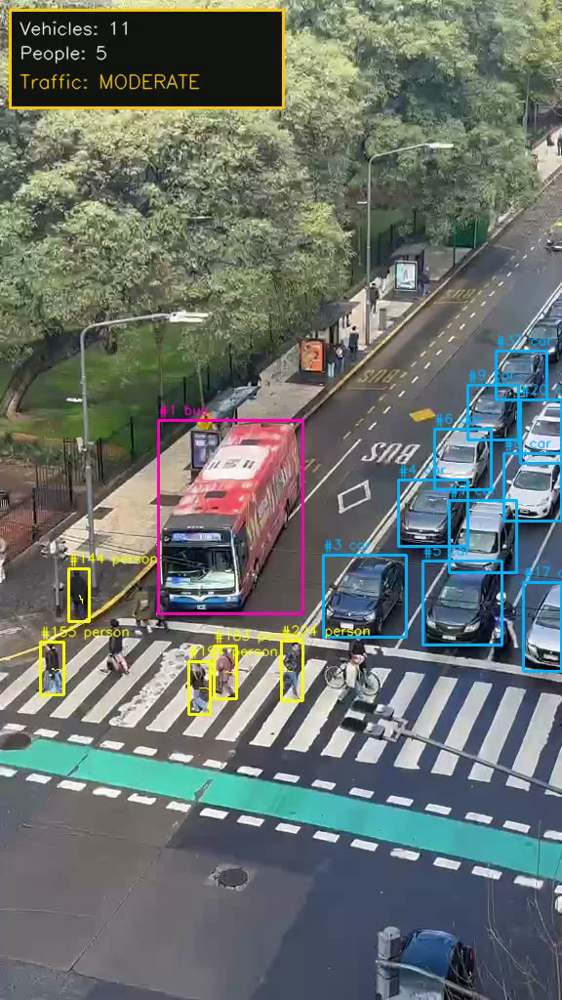

<h1 align="center">FLUX Computer Vision</h1>

<p align="center">
Real-time vehicle & pedestrian tracking with live traffic congestion classification.
</p>

<p align="center">
  <a href="https://github.com/felipebridge/flux-cv/actions/workflows/ci.yml"></a>
  <a href="pyproject.toml"></a>
  <a href="LICENSE"></a>
</p>

<p align="center">
  
</p>

## What it does

Tracks vehicles and pedestrians in traffic video (each counted once, not once per frame),
classifies congestion as LOW / MODERATE / HIGH, and renders an annotated video plus a
Streamlit dashboard over the results.

## Quickstart

```bash
python -m venv .venv && source .venv/bin/activate   # .venv\Scripts\activate on Windows
pip install -e ".[dev]"

python -m traffic_intelligence run --input data/raw/avenue.mp4
python -m traffic_intelligence dashboard
```

## Stack

Python 3.11+ · Ultralytics YOLO (ByteTrack/BoT-SORT) · OpenCV · Pydantic · Pandas ·
Streamlit/Altair · pytest

## Limitations

No labeled ground truth ships with this project, so results are counts, not precision/recall.
Occlusion can still cause a miss or double-count, and congestion thresholds are density cutoffs
tuned per camera, not a universal number.

## Testing

`pytest -q` — config validation, tracking/stitching, and metrics aggregation, no GPU required.

## License

MIT — see [LICENSE](LICENSE).
